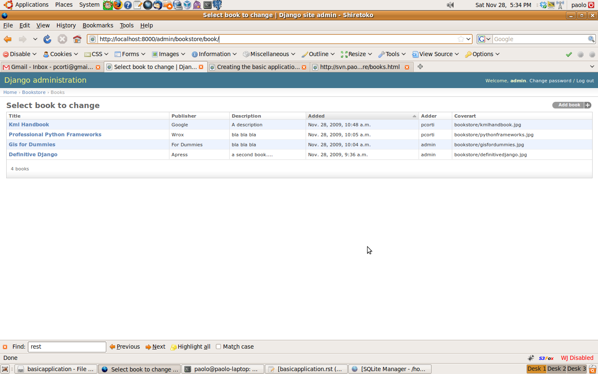
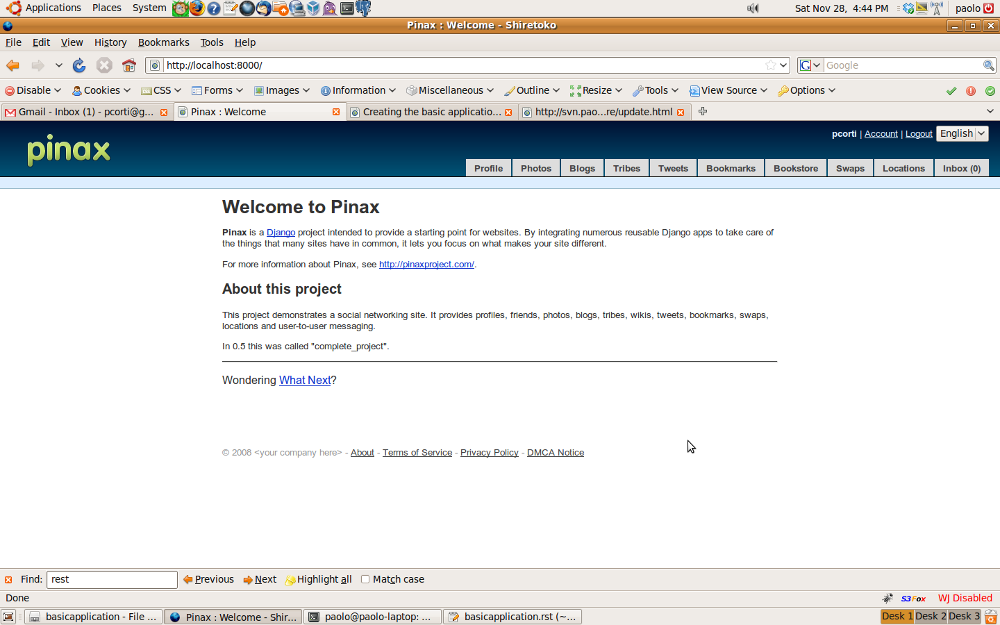
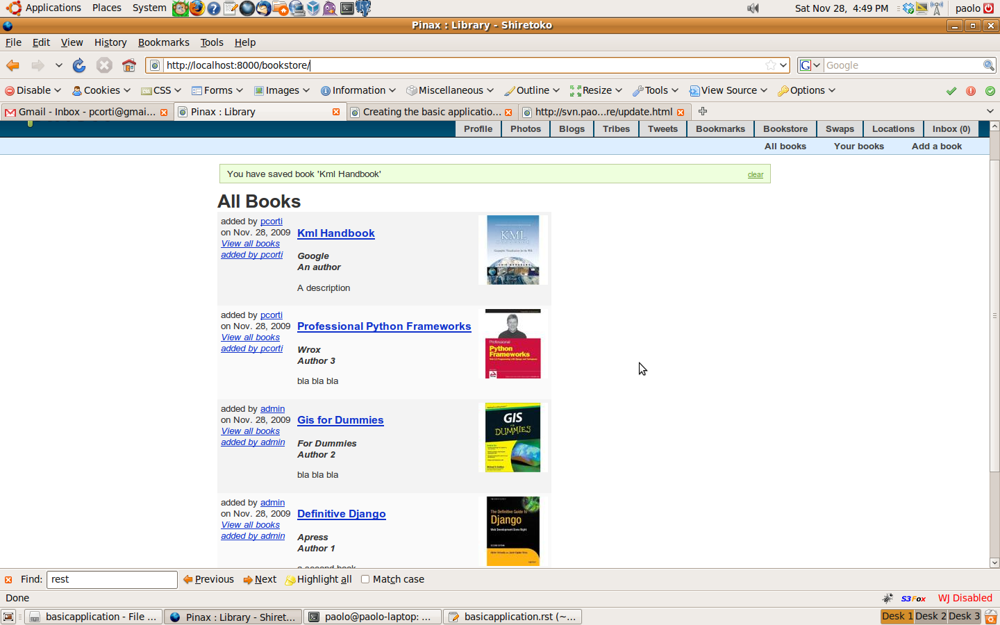
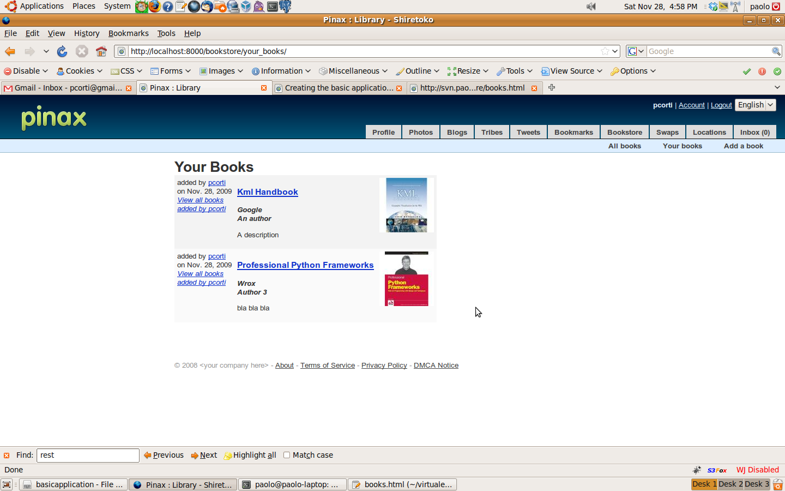
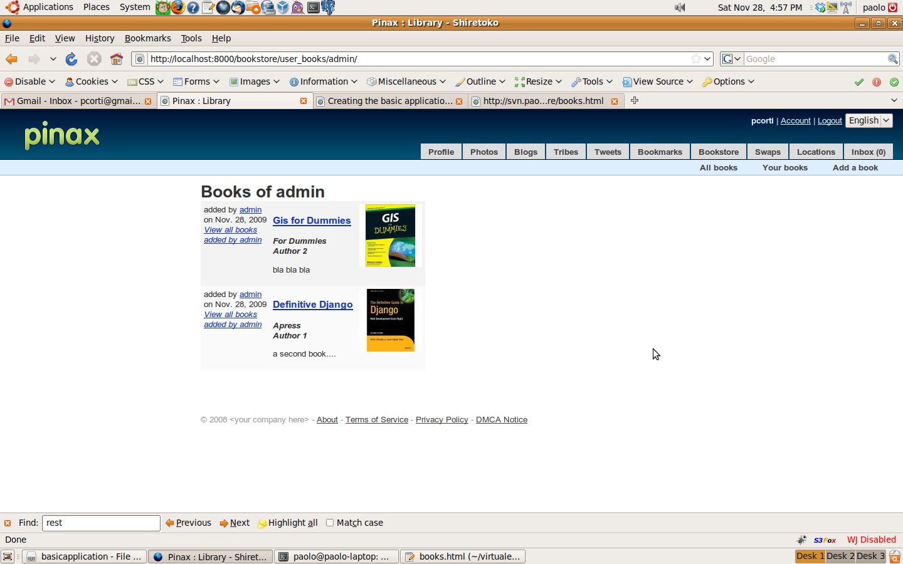
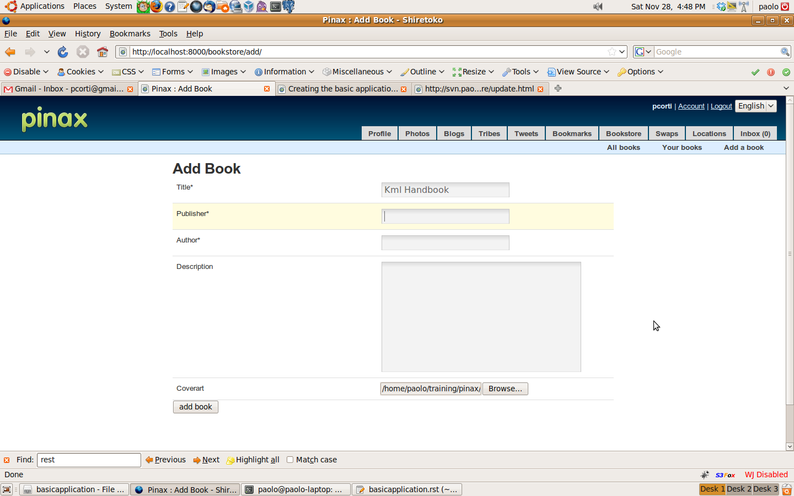
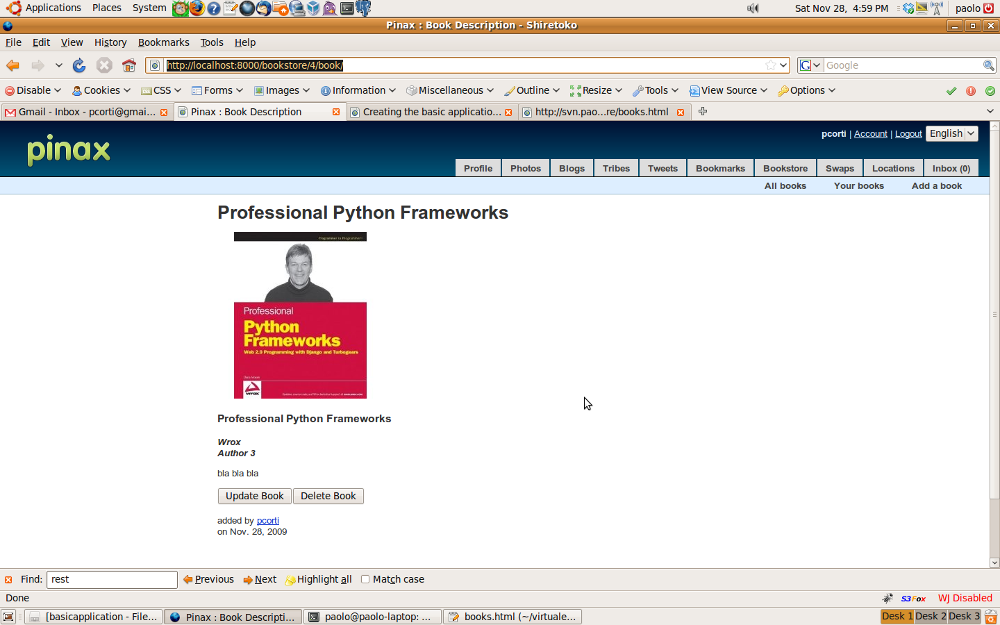
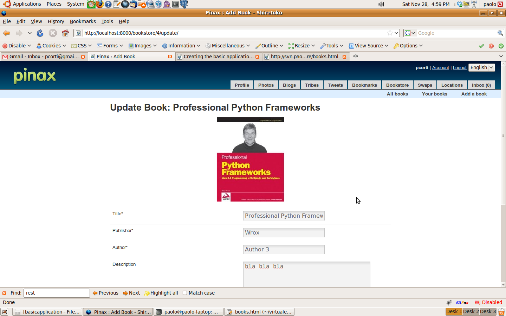

Developing the basic application and plugging it in Pinax
=========================================================

Introduction
------------

In this part of the tutorial you are going to create the core of the bookstore application, with all the pages that gives access to the CRUD (Create, Read, Update, Delete) features. And you are goint to plugin this basic application into Pinax.

After finishing with this part you will have the core of the bookstore application working as desired. You will be able to:

* see a list with all the books in the bookstore
* add a new book
* update and delete your books
* see a list of all books added by you
* see a list of all books added by a user

In the following parts you will add some more goodness like localization, pagination, avatars, profiles, voting, tagging, feeds, comments, notifications, and flags for contents, but basically this part is the most important one and it is the way you can create from scratch an application and make it enabled for Pinax.

Creating the application
------------------------

Before doing anything, give execute permissions to the manage.py command::

    chmod 777 manage.py

Now create the bookstore application::

    ./manage.py startapp bookstore

Now that you have created the application, it it time to add the models, installing it in the Pinax project and syncing the database.

Creating the models
-------------------

For creating the models you need to edit the models.py that has been created for you when creating the application.
Our application will be composed by a single model, named Book.

PROJECT_ROOT/bookstore/models.py ::

    # python
    import os
    from os import path
    from datetime import datetime

    # django imports
    from django.conf import settings
    from django.db import models
    from django.contrib.auth.models import User
    from django.utils.translation import ugettext_lazy as _

    class Book(models.Model):
        """
        Book Model: title, publisher, author, description, coverart, adder, added
        """
        title = models.CharField(_('title'), max_length=255)
        publisher = models.CharField(_('publisher'), max_length=255)
        author = models.CharField(_('author'), max_length=255)
        description = models.TextField(_('description'), blank=True)
        coverart = models.ImageField(upload_to="bookstore", blank=True, null=True) 
        
        adder = models.ForeignKey(User, related_name="added_books", verbose_name=_('adder'))
        added = models.DateTimeField(_('added'), default=datetime.now)

        def get_absolute_url(self):
            return ("describe_book", [self.pk])
        get_absolute_url = models.permalink(get_absolute_url)
        
        def __unicode__(self):
            return self.title
        
        class Meta:
            ordering = ('-added', )
            
        def _get_thumb_url(self, folder, size):
            """ get a thumbnail giver a folder and a size. """
            if not self.coverart:
                return '#'       
            upload_to = path.dirname(self.coverart.path)
            tiny = path.join(upload_to, folder, path.basename(self.coverart.path))
            tiny = path.normpath(tiny)
            if not path.exists(tiny):
                import Image
                im = Image.open(self.coverart.path)
                im.thumbnail(size, Image.ANTIALIAS)
                im.save(tiny, 'JPEG')  
            return path.join(path.dirname(self.coverart.url), folder, path.basename(self.coverart.path)).replace('\\', '/')

        def get_thumb_url(self):
            return self._get_thumb_url('thumb_100_100', (100,100))

        def thumb(self):
            """ Get thumb <a>. """
            link = self.get_thumb_url()
            if link is None:
                return '<a href="#" target="_blank">NO IMAGE</a>'
            else:
                return '' % (link)
        thumb.allow_tags = True 
        
        def fullpicture(self):
            """ Get full picture <a>. """
            link = "%s%s" % (settings.MEDIA_URL, self.coverart)
            if link is None:
                return '<a href="#" target="_blank">NO IMAGE</a>'
            else:
                return '' % (link)
        thumb.allow_tags = True
        
A few notes about the Book's model:

* The basic application of the tutorial implements these fields: title, publisher, author, description, coverart, adder, added
* Also an identifier field, named id, will be created by Django behind the scenes
* The adder field is a foreign key to the user table. This is why you need to import User from django.contrib.auth.models
* The default ordering will be based on the time each book has been added, from the newest to the oldest
* The thumb method returns the url of the thumbnail of the coverart
* The fullpicture method returns the url of the coverart

If you wish that the bookstore application may be managed also from the Django Admin application (this is mainly useful for letting the system administrator to interact with the system), create an admin.py file like this one:

PROJECT_ROOT/bookstore/admin.py ::

    from django.contrib import admin
    from bookstore.models import Book

    class BookAdmin(admin.ModelAdmin):
        list_display = ('title', 'publisher', 'description', 'added', 'adder', 'coverart')

    admin.site.register(Book, BookAdmin)
    
    
A note about localization
-------------------------

One of the aims of this tutorial is also to make the developer confident with the powerful Django's localization features.
One of the part of the tutorial will teach you how to develop a localization-ready application.

Meanwhile just be aware that we will make the strings of the application easily translatable by using two mechanism:

* in the models (as you may have noticed) you will use the ugettext_lazy class from django.utils.translation 
* in the templates you will use the  block

Installing the application in the Pinax project
-----------------------------------------------

Add the Bookstore application in the settings.py file.
Do the same with the Admin application if you want to manage the bookstore application also from there:

PROJECT_ROOT/settings.py ::

    INSTALLED_APPS = (
        # included
        'django.contrib.auth',
        'django.contrib.contenttypes',
        ...
        
        # external
        'notification', # must be first
        'django_openid',
        'emailconfirmation',
        ...
        
        # internal (for now)
        'analytics',
        'profiles',
        'account',
        ...
        
        'django.contrib.admin', # add this line
        
        # my apps
        'bookstore', # also add this line
    )

Syncronizing the database
--------------------

Now that you created a new model, you need to syncronize the database::

    ./manage.py syncdb
    
Note that only a new table is generated, and its named bookstore_book. This is the SQL that has been ran by syncdb::

    CREATE TABLE "bookstore_book" (
        "id" integer NOT NULL PRIMARY KEY,
        "title" varchar(255) NOT NULL,
        "publisher" varchar(255) NOT NULL,
        "author" varchar(255) NOT NULL,
        "description" text NOT NULL,
        "coverart" varchar(100),
        "adder_id" integer NOT NULL REFERENCES "auth_user" ("id"),
        "added" datetime NOT NULL
    )

Consider that I am using Sqlite, if you are using a different database like Postgres, MySql... the SQL may be slightly different.

Time to run the server and test your new application::

    ./manage.py runserver

Now if you access the admin interface, at: http://localhost:8000/admin you will be able to manage your bookstore with basic CRUD pages.

To integrate this CRUD pages into Pinax, you are going to write the views of these pages in the next sections, so keep going with the tutorial.

Configuring the urls
--------------------

Configuring the urls means to design how to map urls to pages.
Any web developers with good habits should plan the pages composing the application that is developing, and mapping them to corresponding urls.

For the Bookstore application this is what is planned to be:

* A page (the home page of the bookstore application) for getting a list of all books: http://localhost:8000/bookstore/
* A page for getting a list of your books: http://localhost:8000/bookstore/your_books/
* A page for getting a list of the books added by a different users: http://localhost:8000/bookstore/user_books/an_user/
* A page for adding a book: http://localhost:8000/bookstore/add/
* A page for viewing a book, given its identifier: http://localhost:8000/bookstore/4/book/ (it this case the book with id=4)
* A page for updating a book, given its identifier: http://localhost:8000/bookstore/4/update/ (it this case the book with id=4)

Now that we planned the urls needed by the bookstore application, you add the mappings to the views in the urls.py file.
Instead than adding these mappings to the central urls.py file of the project, for clearity you create a urls.py file in the bookstore application directory.
Now you need to include this directory in the project urls.py file. 

This is where to add the file in the urls.py project file:

PROJECT_ROOT/urls.py ::

    urlpatterns = patterns('',
        
        ...
        
        (r'^feeds/tweets/(.*)/$', 'django.contrib.syndication.views.feed', tweets_feed_dict),
        (r'^feeds/posts/(.*)/$', 'django.contrib.syndication.views.feed', blogs_feed_dict),
        (r'^feeds/bookmarks/(.*)/?$', 'django.contrib.syndication.views.feed', bookmarks_feed_dict),
        
        # bookstore urls.py file
        (r'^bookstore/', include('bookstore.urls')),

    )

and this is the urls.py file you need to create in the application directory that translate to django the mappings we have planned before:

PROJECT_ROOT/bookstore/urls.py ::

    #from django
    from django.conf.urls.defaults import *

    # from bookstore
    from bookstore.models import Book

    urlpatterns = patterns('',
            url(r'^$', 'bookstore.views.books', name="all_books"),
            url(r'^(\d+)/book/$', 'bookstore.views.book', name="describe_book"),
            url(r'^your_books/$', 'bookstore.views.your_books', name="your_books"),
            url(r'^user_books/(?P<username>\w+)/$', 'bookstore.views.user_books', name="user_books"),
            # CRUD urls
            url(r'^add/$', 'bookstore.views.add_book', name="add_book"),
            url(r'^(\d+)/update/$', 'bookstore.views.update_book', name="update_book"),
            url(r'^(\d+)/delete/$', 'bookstore.views.delete_book', name="delete_book"),
        )

A few notes about the urls:

* each url maps a uri (in a regular expression form) to a Django view. For example in the case of the url named your_books the request made to Django will be managed by a view named your_books
* note that in some case there is a parameter (an integer or a string) in the regular expression: that is for the identifier of a book or for the name of the user. These parameters are passed to the view

Writing the views
-----------------

Now that you have planned all the views composing the application, it is time to actually write them!

PROJECT_ROOT/bookstore/views.py ::

    #from django
    from django.shortcuts import render_to_response, get_object_or_404
    from django.template import RequestContext
    from django.contrib.auth.decorators import login_required
    from django.http import HttpResponseRedirect
    from django.core.urlresolvers import reverse
    from django.utils.translation import ugettext_lazy as _
    from django.contrib.auth.models import User

    #from bookstore
    from bookstore.models import Book
    from bookstore.forms import BookForm

    def books(request):
        """ Return the all books list, ordered by added date. """
        books = Book.objects.all().order_by("-added")
        return render_to_response("bookstore/books.html", {
            "books": books,
            "list": 'all',
        }, context_instance=RequestContext(request))
        
    def user_books(request, username):
        """ Return an user books list. """
        user = get_object_or_404(User, username=username)
        userbooks = Book.objects.filter(adder=user).order_by("-added")
        return render_to_response("bookstore/books.html", {
            "books": userbooks,
            "list": 'user',
            "username": username,
        }, context_instance=RequestContext(request))
        
    def book(request, book_id):
        """ Return a book given its id. """
        isyours = False
        book = Book.objects.get(id=book_id)
        if request.user == book.adder:
            isyours = True
        return render_to_response("bookstore/book.html", {
            "book": book,
            "isyours": isyours,
        }, context_instance=RequestContext(request))
        
    @login_required
    def your_books(request):
        """ Return the logged user books list. """
        yourbooks = Book.objects.filter(adder=request.user).order_by("-added")
        return render_to_response("bookstore/books.html", {
            "books": yourbooks,
            "list": 'yours',
        }, context_instance=RequestContext(request))

    @login_required
    def add_book(request):
        """ Add a book to the bookstore. """
        # POST request
        if request.method == "POST":
            book_form = BookForm(request.POST, request.FILES)
            if book_form.is_valid():
                # from ipdb import set_trace; set_trace()
                new_book = book_form.save(commit=False)
                new_book.adder = request.user
                new_book.save()
                request.user.message_set.create(message=_("You have saved book '%(title)s'") %  {'title': new_book.title})
                return HttpResponseRedirect(reverse("bookstore.views.books"))            
        # GET request
        else:
            book_form = BookForm()
            return render_to_response("bookstore/add.html", {
                "book_form": book_form,
                }, context_instance=RequestContext(request))
        # generic case
        return render_to_response("bookstore/add.html", {
            "book_form": book_form,
        }, context_instance=RequestContext(request)) 
        
    @login_required
    def update_book(request, book_id):
        """ Update a book given its id. """
        book = Book.objects.get(id=book_id)
        if request.method == "POST":
            book_form = BookForm(request.POST, request.FILES, instance=book)
            book_form.is_update = True
            if request.user == book.adder:
                #from ipdb import set_trace; set_trace()
                if book_form.is_valid():
                    book_form.save()
                    request.user.message_set.create(message=_("You have updated book '%(title)s'") %  {'title': book.title})
                    return HttpResponseRedirect(reverse("bookstore.views.books"))            
        else:
            book_form = BookForm(instance=book)
            return render_to_response("bookstore/update.html", {
                "book_form": book_form,
                "book": book,
                }, context_instance=RequestContext(request))  
                  
    @login_required
    def delete_book(request, book_id):
        """ Delete a book given its id. """
        book = get_object_or_404(Book, id=book_id)
        if request.user == book.adder:
            book.delete()
            request.user.message_set.create(message="Book Deleted")
        
        return HttpResponseRedirect(reverse("bookstore.views.books"))
        
Some notes on the views.py file you just created:

* some of the views can be accessed without authenticating to the system: books, user_books, book
* some of the views need authentication to the system: your_books, add_book, update_book, delete_book. In this case you need to use the @login_required decorator
* some of the views have additional input parameter to the request. For example add_book, update_book, delete_book need a book_id parameter to know which book to process
* all of the views define a response defined by a template and some variable that the template must process. For example the user_books renders the response with the books.html template and these variables processed by the response: books, list, username

Note that you also need to create a forms.py file and to add the BookForm that is used from the add_book and update_book views:

PROJECT_ROOT/bookstore/forms.py ::

    #from django
    from django import forms
    from django.utils.translation import ugettext_lazy as _

    #from bookstore
    from bookstore.models import Book

    class BookForm(forms.ModelForm):
        """
        Book Form: form associated to the Book model
        """
        
        def __init__(self, *args, **kwargs):
            super(BookForm, self).__init__(*args, **kwargs)
            self.is_update = False
        
        def clean(self):
            """ Do validation stuff. """
            # title is mandatory
            if 'title' not in self.cleaned_data:
                return
            # if a book with that title already exists...
            if not self.is_update:
                if Book.objects.filter(title=self.cleaned_data['title']).count() > 0:
                    raise forms.ValidationError(_("There is already this book in the library."))
            return self.cleaned_data
        
        class Meta:
            model = Book
            fields = ('coverart', 'publisher', 'author', 'description', 'title', 'tags')
            
Here the form is generated by the model (DRY, Don't Repeat Yourself!). Note that the clean method implements some validation stuff. At this time we do not want a book to be created (or updated) if:

* title is empty
* there is already a book with that title

It is now time to write the application templates, but before doing so let's fix the way the Bookstore application css and images are managed.
Also, before writing the templates, it is finally time to plugin the Bookstore application into Pinax!

Bookstore css and images
------------------------

Create a bookstore directory in the PROJECT_ROOT/media directory.
Inside the bookstore directory create a css directory and an img directory.
Create a bookstore.css file in the css directory like this one:

PROJECT_ROOT/media/bookstore/css/bookstore.css ::

    /* BOOKSTORE */

    table.narrow {
        width: 500px;
    }
    table.bookstore td {
        vertical-align: top;
        padding: 5px;
    }
    table.bookstore td h2 {
        margin: 0;
        padding: 0;
    }
    table.bookstore td.vote {
        width: 80px;
        text-align: center;
        vertical-align: middle;
    }
    .bookstore .even {
        background-color: #FAFAFA;
    }
    .bookstore .odd {
        background-color: #F3F3F3;
    }
    div.url {
        color: #666;
        font-size: 90%;
        font-style: italic;
    }

Plugging the bookstore application into Pinax
---------------------------------------------

To to so, you just need to modify site_base.html to include the the bookstore.css and the bookstore application (you just need to add two lines): 

PROJECT_ROOT/templates/site_base.html::

    
        <link rel="stylesheet" href="{{ STATIC_URL }}css/site_tabs.css" />
        <link rel="stylesheet" href="{{ STATIC_URL }}pinax/css/avatar.css" />
        <link rel="stylesheet" href="{{ STATIC_URL }}pinax/css/blogs.css" />
        <link rel="stylesheet" href="{{ STATIC_URL }}pinax/css/comments.css" />
        <link rel="stylesheet" href="{{ STATIC_URL }}pinax/css/friends.css" />
        <link rel="stylesheet" href="{{ STATIC_URL }}pinax/css/groups.css" />
        <link rel="stylesheet" href="{{ STATIC_URL }}pinax/css/locations.css" />
        <link rel="stylesheet" href="{{ STATIC_URL }}pinax/css/messages.css" />
        <link rel="stylesheet" href="{{ STATIC_URL }}pinax/css/microblogging.css" />
        <link rel="stylesheet" href="{{ STATIC_URL }}pinax/css/pagination.css" />
        <link rel="stylesheet" href="{{ STATIC_URL }}pinax/css/photos.css" />
        <link rel="stylesheet" href="{{ STATIC_URL }}pinax/css/tabs.css" />
        <link rel="stylesheet" href="{{ STATIC_URL }}pinax/css/topics.css" />
        <link rel="stylesheet" href="{{ STATIC_URL }}pinax/css/wiki.css" />
        <link rel="stylesheet" href="{{ STATIC_URL }}pinax/css/jquery.autocomplete.css" />
        <link rel="stylesheet" href="{{ STATIC_URL }}bookmarks/css/bookmarks.css" />
        <!-- here you insert the boookstore css-->
        <link rel="stylesheet" href="{{ STATIC_URL }}bookstore/css/bookstore.css" />
        <!-- end -->
        
    
    ....
    
        
            <ul class="tabs">
                <li id="tab_profile"><a href=""></a></li>
                <li id="tab_photos"><a href=""></a></li>
                <li id="tab_blogs"><a href=""></a></li>
                <li id="tab_tribes"><a href=""></a></li>
                <li id="tab_tweets"><a href=""></a></li>
                <li id="tab_bookmarks"><a href=""></a></li>
                <!-- here you insert the boookstore tab-->
                <li id="tab_bookstore"><a href=""></a></li>
                <!-- end -->
                <li id="tab_swaps"><a href=""></a></li>
                <li id="tab_locations"><a href=""></a></li>
                <li id="tab_inbox"><a href=""> ({{ combined_inbox_count }})</a></li>
            </ul>
        
    

Writing the templates
---------------------

Writing the base template
+++++++++++++++++++++++++

First you create a base template for the Bookstore application. This base template will be extend by all the Bookstore application templates. 

PROJECT_ROOT/templates/bookstore/base.html::

    

    

    id="bookstore_tab"

    
        <ul>
            <li><a href=""></a></li>
            <li><a href=""></a></li>
            <li><a href=""></a></li>
        </ul>
    

Note that this base template extends the site_base.html template you have edited a while ago.
As you can easily deduct, the Bookstore application will have 3 sub menus: "All books", "Your books" and "Add a book".

Creating a template for listing the books
+++++++++++++++++++++++++++++++++++++++++

This is the template that the application will use to render the books, your_books and user_books views.
Before writing any template, you need to create the directory that will actually contain them: create a bookstore directory in the templates directory of the project.
Also you need to create a PROJECT_ROOT/site_media/media/bookstore/thumb_100_100 directory to manage thumbnails, according to the way the get_thumb_url method is written (you could make things easily customisable with a variable in settings.py).

Now it is time to create the books.html, the template for listing the books:

PROJECT_ROOT/templates/bookstore/books.html template ::

    

    

    Library

    
    
        <h1>
            
                
            
            
                {{ username }} 
            
            
                
            
        </h1>
        
        <!-- alternate -->
        
            
            <table class="bookstore">
                
                    <tr class="">
                        <!-- meta -->
                        <td class="meta" >
                            
added by <a href="">{{ book.adder }}</a>

                            on {{ book.added|date }}
                            <a href="/bookstore/user_books/{{ book.adder.username }}"><i>View all books added by {{ book.adder }}</i></a>
                        </td>
                        <!-- book info -->
                        <td>
                            <h3><a href="/bookstore/{{ book.id }}/book/">{{ book.title }}</a></h2>
                            

                                <strong><i>{{ book.publisher }} {{ book.author }} </strong></i>
                                {{ book.description|linebreaks|truncatewords:50 }}
                            

                            
                                <table>
                                    <tr>
                                        <td>
                                            <!-- udpate book -->
                                            <form method="GET" action="">
                                                <input type="submit" value="" />
                                            </form>
                                        </td>
                                        <td>
                                            <!-- delete book -->
                                            <form method="POST" action="">
                                                <input type="submit" value="" />
                                            </form>
                                        </td>
                                    </tr>
                                </table>
                            
                        </td>
                        <!-- cover art -->
                        <td>
                            
{{ book.thumb|safe }}

                        </td>
                    </tr>
                
            </table>
            
            
        
            


        
        
    
    
Notes about this template:

* the 'list' variable is used to define the title of the page ("All books", "Your books", "An user books")
* the 'books' collection is iterated to create a table with a row for each book (the collection may be related to the whole book set, to your book set or to a user book set
* each row contains the following sections (one for each column): meta, book info and coverart
* the meta section displays the user that added the book (with a link to her/his profile), the date when the book has been added and a link to the full book list added by that user
* the book info section displays the book's title with a link to its page, the publisher, the author and the description (truncated after 50 characters). If the template is rendering the your_books view (thus if 'list' == 'Your books'), a link for updating/deleting that book is displayed
* if the books collection is empty the table is not created an the user is warned with a "No books yet." message 

Creating a template for viewing a book
++++++++++++++++++++++++++++++++++++++

This is maybe the easiest of the templates you need to create.
Create the book.html template using the following code:

PROJECT_ROOT/templates/bookstore/book.html template ::

    

    
    

    Book Description

    
        <h1>{{ book.title }}</h1>
            

                 
{{ book.fullpicture|safe }}

            

            

                <!-- book info -->
                <h3>{{ book.title }}</h2>
                

                    <strong><i>{{ book.publisher }} {{ book.author }} </strong></i>
                                {{ book.description|linebreaks }}
                

            

            

                <!-- book action -->
                
                    <table>
                        <tr>
                            <td>
                                <!-- udpate book -->
                                <form method="GET" action="">
                                    <input type="submit" value="" />
                                </form>
                            </td>
                            <td>
                                <!-- delete book -->
                                <form method="POST" action="">
                                    <input type="submit" value="" />
                                </form>
                            </td>
                        </tr>
                    </table>
                
            

            

                <!-- meta -->
                
added by <a href="">{{ book.adder }}</a>
on {{ book.added|date }}
            

            
    
    
It is a bit like the books.html template, but here Django is rendering only one book. You may note that:

* the variable book is used to gain information about the book to render
* the variable isyours is needed to let the user to update or delete the book if she/he is the user who has added it
* there are 3 sections in the book representation: book info, book action, meta
* book info displays the book's cover art, title, publisher, author and description
* book action displays the buttons to update or delete the book if the user is the one who has added it in the system
* meta displays the user that added the book (with a link to his/her profile) and the date when the book has been added

Creating a template for adding a book
+++++++++++++++++++++++++++++++++++++

Now create the add.html template, for adding new books to the library:

PROJECT_ROOT/templates/bookstore/add.html template ::

    

    
    

    Add Book

    
        <h1></h1>
        
        <form enctype="multipart/form-data" method="POST" action="" class="uniForm">
            <fieldset class="inlineLabels">
                {{ book_form|as_uni_form }}
                

                    <input type="submit" value="">
                

            </fieldset>
        </form>
    
    
Here there is nothing much to explain, you are rendering the template with a BookForm variable.

Creating a template for updating an existing book
+++++++++++++++++++++++++++++++++++++++++++++++++

Time to create the update template, for updating a book in the library:

PROJECT_ROOT/templates/bookstore/update.html template ::

    

    
    

    Add Book

    
        <h1>{{ book.title }}</h1>
            <form enctype="multipart/form-data" method="POST" action="" class="uniForm">
                
{{ book.fullpicture|safe }}

                <fieldset class="inlineLabels">
                    {{ book_form|as_uni_form }}
                    

                        <input type="submit" value="">
                    

                </fieldset>
            </form>
    
    
Basically this template is like the add.html ones, with another variable - the book - coming from the view.
    
A quick tour of the basic bookstore application
-----------------------------------------------

Now that you are over writing the models, the view and the templates of the application, you may finally test if everything is working properly.

If you still didn't do so, start the development server and try visiting the pages and access the features you have implemented.

1. Visit the Pinax home page: http://localhost:8000

    
2. Visit the Bookstore all books page: http://localhost:8000/bookstore/

    
3. Consult your books: http://localhost:8000/bookstore/your_books/

    
4. Consult the books added by a different users: http://localhost:8000/bookstore/user_books/admin/

    
5. Add a book: http://localhost:8000/bookstore/add/

    
6. View a book: http://localhost:8000/bookstore/4/book/

    
7. Update a book added by you: http://localhost:8000/bookstore/4/update/

What's next
-----------

Now that you are ready with the basic bookstore application, you may read the next tutorial parts (as soon as they will appear at this blog) in order to implement other features like localization, pagination, avatars, profiles, voting, tagging, feeds, comments, notifications, and flags for contents.

Where can I get the code?
-------------------------

The whole tutorial is at gitHub: http://github.com/capooti/pinaxtutorial
There you can download tutorial's code, and the tutorial text in restructured text format (Sphinx ready).

