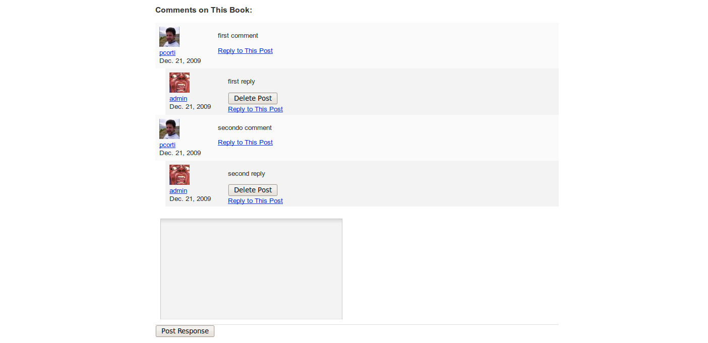
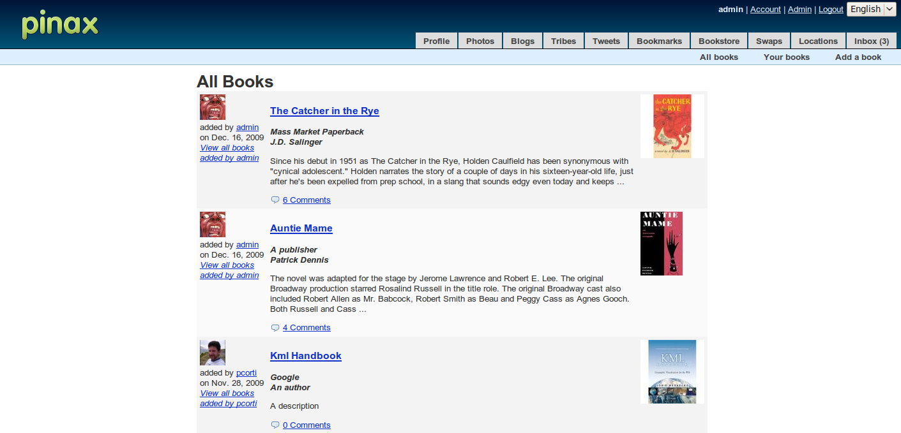

=======================
Adding a comment system
=======================

Introduction
------------

In this part we will improve the Bookstore application: what I am going to show is how easy it is to add support for enabling comments for a book without writing from scratch another comment system (as you may already now, avoid rewriting things is the core philosophy of Pinax and Django).

Basically, you could add this feature by using one of these two approaches (there may be other ones, but these are the most common):

* `Django comments framework <http://docs.djangoproject.com/en/dev/ref/contrib/comments/>`_
* the `django-threadedcomments system <http://github.com/ericflo/django-threadedcomments>`_, that - as suggested by its name - it offers support for comments in a threaded fashion

You will implement a commenting system in the application you are developing by using the django-threadedcomments system.

Setup
-----

You need to make sure that, in your settings file, you have the django-threadedcomments system enabled:

PROJECT_ROOT/settings.py::

	INSTALLED_APPS = (
	...
	'threadedcomments',
	'threadedcomments_extras',
	...
	'bookstore',
	)
    
if you didn't customize things, you should have this two applications already enabled (not commented).

Using django-threadedcomments in the templates
----------------------------------------------

Now that you have enabled in your project the django-threadedcomments system, it is very easy to add support for comments in your pages (templates).

Modifying the book.html template
++++++++++++++++++++++++++++++++

First we want to make possible to add comments for a book. You need to modify the book.html template.

To do so you need to do basically two things:

* Add 
* Insert the  tag where is needed (where you want to enable comments)

This is how it should look the code of the PROJECT_ROOT/bookstore/templates/bookstore/book.html template ::

	
	
	
	
	
	...
			

			<!-- meta -->
			...
			<!-- comments -->
			<h3 id="comments">Comments on this Book:</h3>
			
	...
	
Now if you navigate to a book page, it will be possible to add new comment or reply to existing comments:

Modifying the books.html template
+++++++++++++++++++++++++++++++++

We also want, in the books.html template, to display the number of comments for each book. To do so do the following:

* Add 
* use the get_comment_count function as needed

This is how it should look the code of the PROJECT_ROOT/bookstore/templates/bookstore/books.html template ::

	
	
	
	
	
	...
	<table class="bookstore">
	
	...
		

			<strong><i>{{ book.publisher }} {{ book.author }} </strong></i>
			{{ book.description|linebreaks|truncatewords:50 }}
		

		<!-- comments -->
		
			<a href="/bookstore/{{ book.id }}/book/#comments">
			{{ commentcount }} Comments</a> 
		
		...
	...
	

If you navigate to the books page, it will be possible to see how many comments have been posted for each book:
    

    
How it works
------------

Note that you didn't sync the database because the table needed from the django-threadedcomments's model (named threadedcomments_threadedcomment) was already created when you first have created the project.

If you access to the contents of this table, for example via the admin:

http://localhost:8000/admin/threadedcomments/threadedcomment/

you can notice that a row is created for every comment that has been inserted in the portal.

Important fields of this table are:

* user_id: the user that created the comment
* content_type: the content type for which the comment has been created (in this case a book)
* object_id: the content for which the comment has been created
* parent_id: a self join to the comment for which the comment is threaded (null if it is not threaded)

by storing this information in the database, it is easy to relate a comment to a specific book (or to other contents in the portal).

Notes
-----

As usual I have updated the gitHub repository for this project (the Pinax Tutorial) with all the stuff you many need to go along with it:

* You can find the code of this part of the tutorial `here <http://github.com/capooti/pinaxtutorial/tree/PinaxTutorial-5>`_
* You can find updated documentation in reST format ` here <http://github.com/capooti/pinaxtutorial/tree/PinaxTutorial-5/docs/>`_
* You can download a pdf copy of this tutorial here `<http://github.com/capooti/pinaxtutorial/blob/PinaxTutorial-5/pinaxtutorial.pdf>`_

