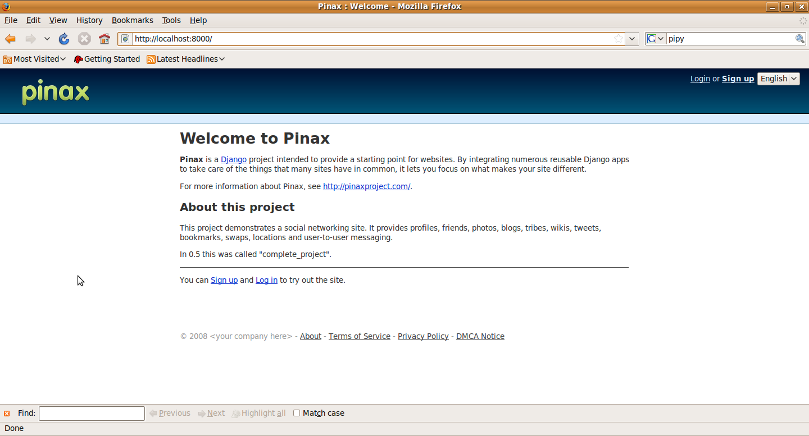
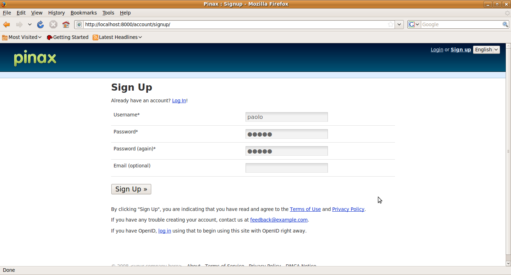
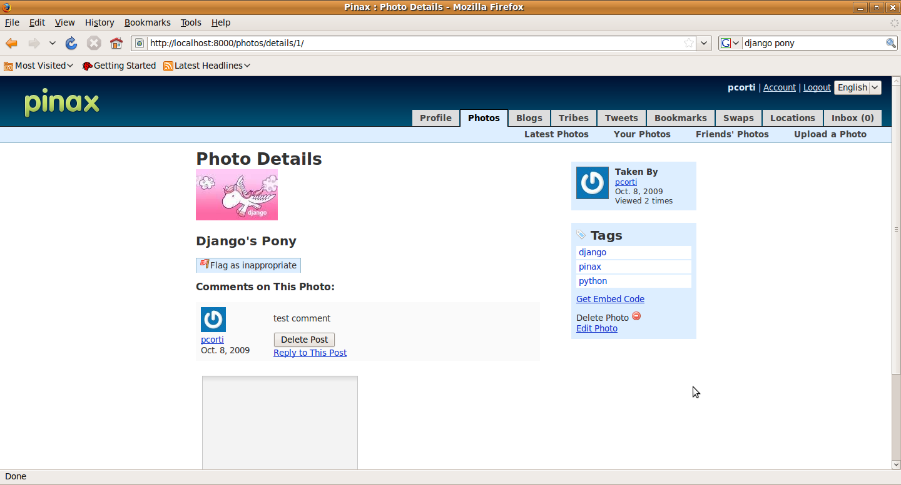

Installing Pinax and making basic customisation
===============================================

I will assume you are installing Pinax v0.7.1 on a Ubuntu 9.04 box, but this procedure - with a few modifications, should work well on every Linux box. For Windows please refer to the Pinax official site or - rather I highly reccomend to use `VirtualBox <http://www.virtualbox.org/>`_, and to create an Ubuntu 9.04 Virtual Machine, so you will be able to follow step by step this tutorial.
There are ready images like `this one <http://go2.wordpress.com/?id=725X1342&site=virtualbox.wordpress.com&url=http%3A%2F%2Fdownloads.sourceforge.net%2Fvirtualboximage%2Fubuntu-9.04-x86.7z>`_, to make things even easier.

As suggested from the `official installation procedure <http://pinaxproject.com/docs/0.7/install.html>`_, the release bundle has everything you need for running Pinax.
What is not included is:

* Python;
* `Python Imaging Library (PIL) <http://www.pythonware.com/products/pil/>`_;
* `SQLite <http://www.sqlite.org/>`_.

Ubuntu 9.04 includes Python 2.6, PIL 1.1.6 and SQLite 3.6.10, so you have everything. If you are using another Ubuntu version or a different Linux distribution, please verify to have all of this software. You will install and use for this tutorial Pinax v0.7.1 (latest release at the date of this post).

Installing Pinax
----------------

Download Pinax
++++++++++++++

First step for installing Pinax is to download it. First create a directory named virtualenv, then download the tar.gz bundle and extract it in that directory ::

	paolo@ubuntu:~/virtualenv$ wget http://downloads.pinaxproject.com/Pinax-0.7.1-bundle.tar.gz
	paolo@ubuntu:~/virtualenv$ tar zxf Pinax-0.7.1-bundle.tar.gz

Creation of the virtualenv
++++++++++++++++++++++++++

The best way to try (and to develop with) Pinax is to use `virtualenv <http://pypi.python.org/pypi/virtualenv>`_.
If you want to know more about virtualenv take a look at the official documentation.
In short words here I can say that what virtualenv does (and does it well!) is creating isolated Python environments.

There are 3 main benefits using virtualenv:

* It is impossible to create different environments with different versions of Django, Pinax or whatever other Python Packages using the Python on the system (everything would be installed in /usr/lib/python2.5/site-packages and you could not install two different versions of the same component)
* You may be interested to install an application and to leave it in that situation forever, without updating any components on which the application is based
* You may not have - for example in a shared host - the privileges to install packages in site-packages directory

Virtualenv solve all this problems, so using it is definitely a good idea. Plus, it includes the excellent `Setuptools <http://pypi.python.org/pypi/setuptools>`_, and you will be able to use the `easy_install <http://peak.telecommunity.com/DevCenter/EasyInstall>`_ command to install Python packages in your virtualenv in a breeze.

Let's see a concrete example: you are going to create a virtualenv with Python 2.5, Django 1.1 and IPython (if you are new to Python you may wonder about what IPython is: a very complete article describing IPython is `here <http://onlamp.com/pub/a/python/2005/01/27/ipython.html>`_).

First you may probably need the virtualenv command, if you have never used. For installing it (on Debian and Ubuntu)::

	(pinax-env)paolo@ubuntu:~/virtualenv$ sudo apt-get install python-virtualenv

Now you can create the virtualenv, naming it myenv::

	(pinax-env)paolo@ubuntu:~/virtualenv$ virtualenv --python=python2.5 myenv

If you are on a scratch Ubuntu 9.04 installation, IPython and Django are not available, plus the default Python is version 2.6.2. To prove this just look the following::

	paolo@ubuntu:~/virtualenv/myenv$ ipython
	The program 'ipython' is currently not installed.  To run 'ipython' please ask your administrator to install the package 'ipython'
	bash: ipython: command not found
	paolo@ubuntu:~/virtualenv/myenv$ python
	Python 2.6.2 (release26-maint, Apr 19 2009, 01:56:41) 
	[GCC 4.3.3] on linux2
	Type "help", "copyright", "credits" or "license" for more information.
	>>> import django
	Traceback (most recent call last):
	  File "<stdin>", line 1, in <module>
	ImportError: No module named django

Now activate the virtualenv you have just created. Activating a virtualenv is easily done by typing::

	(pinax-env)paolo@ubuntu:~/virtualenv$ cd myenv/
	(pinax-env)paolo@ubuntu:~/virtualenv/myenv$ source bin/activate

Now install django 1.1 and ipython in myenv, by using the easy_install command::

	(myenv)paolo@ubuntu:~/virtualenv/myenv$ easy_install http://www.djangoproject.com/download/1.1/tarball/
	(myenv)paolo@ubuntu:~/virtualenv/myenv$ easy_install ipython

Now you are able to use ipython and you can succesfully import Django 1.1::

	(myenv)paolo@ubuntu:~/virtualenv/myenv$ ipython
	Python 2.5.4 (r254:67916, Apr  4 2009, 17:55:16) 
	Type "copyright", "credits" or "license" for more information.
	...
	In [1]: import django
	In [2]: django.VERSION
	Out[2]: (1, 1, 0, 'final', 0)

Note that the IPython is now installed, the default Python here is 2.5.4, and the Django version 1.1.0 is available.
You can easily check that nothing has been written to the /usr/lib/python2.5/site-packages directory, but everything is under the site-packages directory of the virtualenv::

	(myenv)paolo@ubuntu:~/virtualenv/myenv/lib/python2.5/site-packages$ ls
	Django-1.1-py2.5.egg  easy-install.pth  ipython-0.10-py2.5.egg  setuptools-0.6c9-py2.5.egg  setuptools.pth

Now that you understand what a virtualenv is, you are ready to create the virtual environment, and you will name it pinax-env. For doing so you will use a python script included in the Pinax bundle instead than the virtualenv command::

	paolo@ubuntu:~/virtualenv$ cd Pinax-0.7.1-bundle/
	paolo@ubuntu:~/virtualenv/Pinax-0.7.1-bundle$ python scripts/pinax-boot.py ../pinax-env

Wait a while while the virtualenv is created, and then activate it::

	paolo@ubuntu:~/virtualenv/Pinax-0.7.1-bundle$ cd ../pinax-env/
	paolo@ubuntu:~/virtualenv/pinax-env$ source bin/activate

Note now what is in the virtualenv site-packages directory (tons of useful stuff, this is the Pinax core!)::

	(pinax-env)paolo@ubuntu:~/virtualenv/pinax-env$ ls lib/python2.6/site-packages/
	ajax_validation                                 django_markup                                      Pinax-0.7.1-py2.6.egg-info
	announcements                                   django_markup-0.3-py2.6.egg-info                   pip-0.4.1devdev-py2.6.egg
	atom                                            django_messages-0.4.2-py2.6.egg-info               pygments
	atomformat.py                                   django_microblogging-0.1.2-py2.6.egg-info          Pygments-1.0-py2.6.egg-info
	...
	
To be sure that everything is fine, you may try if your virtualenv can import Django and Pinax::

	In [1]: import django
	In [2]: django.VERSION
	Out[2]: (1, 0, 3, 'final', 0)
	In [3]: import pinax
	In [4]: pinax.VERSION
	Out[4]: (0, 7, 0, 'final')

The Pinax directory structure
+++++++++++++++++++++++++++++

Let's spend just a few lines about the Pinax directory structure.

There are two main places where Pinax live: the site-packages directory of your virtualenv and the project directory. You will see later the project directory structure, now I make some considerations about the site-packages directory: as you have seen a few lines above, this directory contains a ton of Python packages that are included in Pinax: you will find there most of the applications and packages we have been talking in the introduction, like for example the bookmarks, the mailer and the swaps applications.

Also, in the site-packages there is the Pinax directory. This is its structure (we show only 2 levels here)::

	paolo@ubuntu:~/virtualenv/pinax-env/lib/python2.6/site-packages/pinax$ tree -d -L 2
	.
	|-- apps
	|   |-- account
	|   |-- analytics
	|   |-- authsub
	|   |-- autocomplete_app
	|   |-- basic_profiles
	|   |-- bbauth
	|   |-- blog
	|   |-- groups
	|   |-- photos
	|   |-- profiles
	|   |-- projects
	|   |-- signup_codes
	|   |-- tagging_utils
	|   |-- tasks
	|   |-- threadedcomments_extras
	|   |-- topics
	|   |-- tribes
	|   |-- voting_extras
	|   `-- waitinglist
	|-- core
	|   |-- management
	|   `-- serializers
	|-- fixtures
	|   `-- generate
	|-- media
	|   `-- default
	|-- middleware
	|-- projects
	|   |-- basic_project
	|   |-- cms_project_company
	|   |-- cms_project_holidayhouse
	|   |-- code_project
	|   |-- intranet_project
	|   |-- private_beta_project
	|   |-- sample_group_project
	|   `-- social_project
	|-- templates
	|   `-- default
	|-- templatetags
	|   `-- templatetags
	`-- utils

A few notes: some of the applications, like the blog, the profile and the projects ones, are developed directly in the Pinax packages (at least at this time), and they are in the apps directory.

The media directory contains all of the css and images needed by Pinax and by its applications.

The projects directory contains the template projects you may use to not start from scratch a Pinax project (more in the next paragraphs about this, but basically for starting you will just need to copy one of them).

The templates directory contains the Pinax themes: at this time there is only one available theme (more are coming in the future), called default. Soon we will see how we can customise the templates.

Creation of the Pinax project
-----------------------------

Now it is time to create a Pinax project. Here the way to go is to clone one of the existing Pinax templates projects, using the pinax-admin clone_project, available to you in your virtualenv.

To see a list of available existing projects, use the -l option like this::

	(pinax-env)paolo@ubuntu:~/virtualenv/pinax-env$ pinax-admin clone_project -l
	Available Projects
	------------------
	sample_group_project:
		This project demonstrates group functionality with a barebones group
		containing no extra content apps as well as two additional group types,
		tribes and projects, which show different membership approaches and
		content apps.

	intranet_project:
		This project demonstrates a closed site requiring an invitation to join and
		not exposing any information publicly. It provides a top-level task tracking
		system, wiki and bookmarks. It is intended to be the starting point of sites
		like intranets.

	social_project:
		This project demonstrates a social networking site. It provides profiles,
		friends, photos, blogs, tribes, wikis, tweets, bookmarks, swaps,
		locations and user-to-user messaging.
		
		In 0.5 this was called "complete_project".

	cms_project_holidayhouse:
		A very simple CMS that lets you set up templates and then edit content,
		including images, right in the frontend of the site.
		
		The sample media, templates and content including in the project demonstrate
		a basic site for holiday house rentals.

	code_project:
		This project demonstrates group functionality and the tasks, wiki and topics
		apps. It is intended to be the starting point for things like code project
		management where each code project gets its own wiki, task tracking system
		and threaded discussions.

	private_beta_project:
		This project demonstrates the use of a waiting list and signup codes for
		sites in private beta. Otherwise it is the same as basic_project.

	cms_project_company:
		A very simple CMS that lets you set up templates and then edit content,
		including images, right in the frontend of the site.
		
		The sample media, templates and content including in the project demonstrate
		a basic company website.

	basic_project:
		This project comes with the bare minimum set of applications and templates
		to get you started. It includes no extra tabs, only the profile and notices
		tabs are included by default. From here you can add any extra functionality
		and applications that you would like.

Take a while for reading about all the templates project that are provided by Pinax. The easiest and minimal way to start a Pinax project would be to start from the basic_project.
But here we want to see more Pinax stuff in action, so we will start from the social_project. 
You will clone the social_project, creating a project named pinaxtutorial::

	(pinax-env)paolo@ubuntu:~/virtualenv/pinax-env$ pinax-admin clone_project social_project pinaxtutorial

Finally you need to sync the project with the database (we are using the default database engine, Sqlite, but if you wish you may change the settings.py database section and choose another database, for example the really excellent Postgres)::

	(pinax-env)paolo@ubuntu:~/virtualenv/pinax-env$ cd pinaxtutorial/
	(pinax-env)paolo@ubuntu:~/virtualenv/pinax-env/pinaxtutorial$ chmod 777 manage.py
	(pinax-env)paolo@ubuntu:~/virtualenv/pinax-env/pinaxtutorial$ ./manage.py syncdb
	Creating table auth_permission
	Creating table auth_group
	Creating table auth_user
	Creating table auth_message
	Creating table django_content_type
	Creating table django_session
	Creating table django_site
	Creating table notification_noticetype
	Creating table notification_noticesetting
	
	...
	
	You just installed Django's auth system, which means you don't have any superusers defined.
	Would you like to create one now? (yes/no): yes
	Username (Leave blank to use 'paolo'): 
	E-mail address: pcorti@gmail.com
	Password: 
	Password (again): 
	Superuser created successfully.
	Installing index for auth.Permission model
	Installing index for auth.Message model
	Installing index for notification.NoticeSetting model
	
	...
	
	Installing json fixture 'initial_data' from '/home/paolo/virtualenv/pinax-env/lib/python2.6/site-packages/oembed/fixtures'.
	Installing json fixture 'initial_data' from '/home/paolo/virtualenv/pinax-env/lib/python2.6/site-packages/pinax/apps/photos/fixtures'.
	Installed 18 object(s) from 2 fixture(s)

So, using the sync option of the django-admin command, all the tables needed from Pinax and Django have been created. You can easily test this by querying the sqlite_master table (if you are using that engine, of course)::

	(pinax-env)paolo@ubuntu:~/virtualenv/pinax-env/pinaxtutorial$ sqlite3 dev.db 
	SQLite version 3.6.10
	Enter ".help" for instructions
	Enter SQL statements terminated with a ";"
	sqlite> select * from sqlite_master;

all the tables just created are listed.

Also, when syncing the database for the first time, you are asked to create the superuser for your application. For example, I created a superuser named like me.

First look at the Pinax project
+++++++++++++++++++++++++++++++

Now you are ready to start and try the project we just created::

	(pinax-env)paolo@ubuntu:~/virtualenv/pinax-env/pinaxtutorial$ ./manage.py runserver
	Validating models...
	0 errors found

	Django version 1.0.3, using settings 'pinaxtutorial.settings'
	Development server is running at http://127.0.0.1:8000/
	Quit the server with CONTROL-C.
	
Now if you type in the brower http://localhost:8000, your will access the Pinax project home page:

    
Now try to register a user by going to the signup page: http://localhost:8000/account/signup/

    
After registering the user try uploading a photo: http://localhost:8000/photos/upload/ and try to add some test comment to it:

    
Now take some more time to learn what the pinax social_project offers: there is a ton of stuff already set to be used in your production environment, if you wish. Have fun digging the profiles, blogs, tribes, tweets, bookmarks, swaps and locations sections. Also be delighted by the production-ready messaging system, and by the authentication system.

Making basic customisation
--------------------------

Now that you are ready with your Pinax environment, you are going to make the last little step at this time: you will learn how easy is in Pinax to make (very) basic customisation.

Keep in mind that, according to the settings.py of the project you created, templates are loaded from two different directories::

	(settings.py)
	TEMPLATE_DIRS = (
		os.path.join(PROJECT_ROOT, "templates"),
		os.path.join(PINAX_ROOT, "templates", PINAX_THEME),
	)

in my Ubuntu box, the templates directories are in the project directory: ~/virtualenv/pinax-env/pinaxtutorial and in the pinax directory: ~/virtualenv/pinax-env/lib/python2.6/site-packages/pinax.

For the sake of brevity, I will refer to this two directory as PROJECT_ROOT and PINAX_ROOT in the following sections.

Now, for obvious reasons, storing your basic customisation by modifying the templates in the PINAX_ROOT would not be a good choice: as soon as you would decide to update your Pinax installation with a new release of Pinax or from new updates from the trunk if you are living on the edge using the Pinax development version, your html modified templates would be replaced by the new ones and you would miserably loose your customisation.

The best way to go, as with many pythonic things, is to override the templates of the PINAX_ROOT templates directory with the templates of the PROJECT_ROOT templates directory.

Let's see a concrete sample. Suppose you want to change the text of the about page (it is here: http://localhost:8000/about/). According to the central urls.py file::

	(PROJECT_ROOT/urls.py)
	(r'^about/', include('about.urls')),
	
The urls for the about/ views of our project are included in the PROJECT_ROOT/apps/about/urls.py file::

	urlpatterns = patterns('',
		url(r'^$', direct_to_template, {"template": "about/about.html"}, name="about"),
		
		url(r'^terms/$', direct_to_template, {"template": "about/terms.html"}, name="terms"),
		url(r'^privacy/$', direct_to_template, {"template": "about/privacy.html"}, name="privacy"),
		url(r'^dmca/$', direct_to_template, {"template": "about/dmca.html"}, name="dmca"),
		
		url(r'^what_next/$', direct_to_template, {"template": "about/what_next.html"}, name="what_next"),
	)

It is easy to understand that you need to change the about/about.html template for modifying your about page. But wait! there is not the PROJECT_ROOT/templates/about/about.html template.
There is, instead, the PINAX_ROOT/templates/default/about/about.html: your project is feeding the about view by that file. According to what we have written a few lines before, you DO NOT change this file. But you override it recreating this file in your PROJECT_ROOT/templates/about directory.

So this is what you have to do: first create the PROJECT_ROOT/templates/about/about.html template file. Then put this few lines in it (I am copying - with little modifications - the PINAX_ROOT/templates/default/about/about.html file)::

	
	
	
	
		
		    
My new <b>About Page</b>

		
		
		    Pinax includes the <a href="http://www.famfamfam.com/lab/icons/silk/">Silk icon set 1.3</a> by Mark James.
		
	
	
If you now go to: http://localhost:8000/about/ you will see your new about page, rendered from the about.html template you created in the PROJECT_ROOT/templates/about directory.

	

