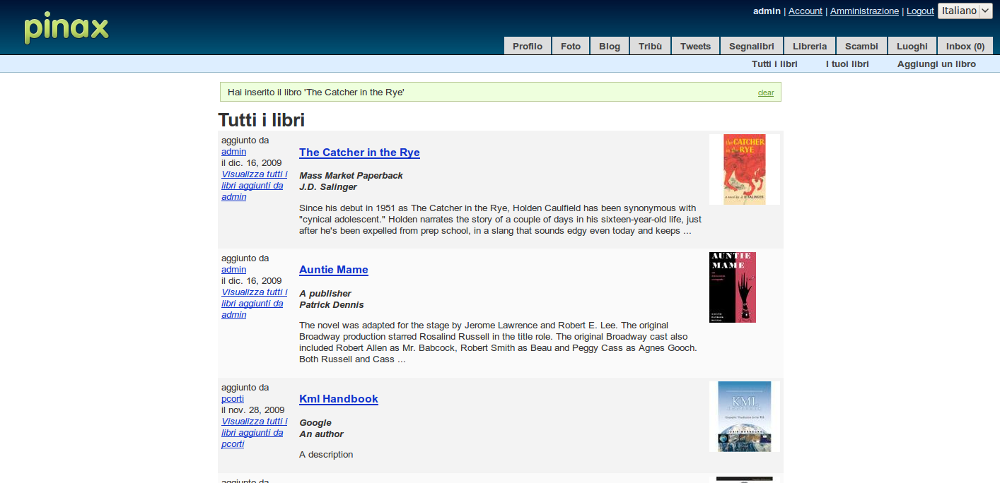

Internationalization of the application
=======================================

(Note that, if you completed the other parts of this tutorial before the date of this post, you need to move the PROJECT_ROOT/templates/bookstore directory in PROJECT_ROOT/bookstore/templates: so now you will have a PROJECT_ROOT/bookstore/templates/bookstore directory. I did so for a better deployment experience, and doing so I am following the Django best practices. If you are reading the pdf version of the tutorial or the reST documentation, then this documentation is already updated with the templates directory in the right place).

In this part of the tutorial I will show how easy it is to enable your application for internationalization with Pinax.

Enabling internationalization for a Pinax application is just the same procedure for enabling it for a Django application.

You can find a complete discussion about Django's internationalization mechanism `here <http://docs.djangoproject.com/en/dev/topics/i18n/>`_
Be sure to read this discussion before going on with this tutorial.

To enable internationalization for your application you will need to complete three steps:

* use translation strings in Python code and templates
* create language files
* change settings

Let's see how to apply them to the Bookstore application you are developing.

Using translation strings in Python code and templates
------------------------------------------------------

In the Bookstore application we have already used translation strings in Python code and templates with the help of the django.utils.translation.ugettext_lazy() function and the  (and ) template tag. For example:

In the model: PROJECT_ROOT/bookstore/models.py::

	...
	from django.utils.translation import ugettext_lazy as _

	class Book(models.Model):
		"""
		Book Model: title, publisher, author, description, coverart, adder, added
		"""
		title = models.CharField(_('title'), max_length=255)
		publisher = models.CharField(_('publisher'), max_length=255)
		author = models.CharField(_('author'), max_length=255)
		....

In the views: PROJECT_ROOT/bookstore/views.py::

	...
	from django.utils.translation import ugettext_lazy as _
	...
	@login_required
	def add_book(request):
		""" Add a book to the bookstore. """
		# POST request
		if request.method == "POST":
		    book_form = BookForm(request.POST, request.FILES)
		    if book_form.is_valid():
		        new_book = book_form.save(commit=False)
		        new_book.adder = request.user
		        new_book.save()
		        request.user.message_set.create(message=_("You have saved book '%(title)s'") %  {'title': new_book.title})
		        return HttpResponseRedirect(reverse("bookstore.views.books"))
		...
	...

In the templates: PROJECT_ROOT/bookstore/templates/bookstore/base.html::

	

	

	id="bookstore_tab"

	
		<ul>
		    <li><a href=""></a></li>
		    <li><a href=""></a></li>
		    <li><a href=""></a></li>
		</ul>
	

Note that I did not use translation strings for everything in the previous chapters, so if you have time try to cover the totality of the code (or download the source code of this tutorial part at gitHub, as suggested at the ending).

Creating and compiling language files
-------------------------------------

Once you have tagged your strings for being translated, you need to write the languages files for any language you wish the application needs to be translated.

Language files for the Bookstore application
++++++++++++++++++++++++++++++++++++++++++++

For example create a message file for Italian language by using the django-admin.py makemessages tool. First we are going to create the message file in the application directory to enable internationalization for the Bookstore Application (note that we need to create a locale directory before)::
	
	(pinax-env)paolo@paolo-laptop:~/virtualenv/pinax-env/pinaxtutorial/bookstore$ django-admin.py makemessages -l it
	Error: This script should be run from the Django SVN tree or your project or app tree. If you did indeed run it from the SVN checkout or your project or application, maybe you are just missing the conf/locale (in the django tree) or locale (for project and application) directory? It is not created automatically, you have to create it by hand if you want to enable i18n for your project or application.
	(pinax-env)paolo@paolo-laptop:~/virtualenv/pinax-env/pinaxtutorial/bookstore$ mkdir locale
	(pinax-env)paolo@paolo-laptop:~/virtualenv/pinax-env/pinaxtutorial/bookstore$ django-admin.py makemessages -l it
	processing language it

Open the django.po file that has been created, and change the msgstr for each msgid.

PROJECT_ROOT/bookstore/locale/it/LC_MESSAGES/django.po::

	...
	#: forms.py:25
	msgid "There is already this book in the library."
	msgstr "Esiste già questo libro nella libreria."

	#: models.py:16
	msgid "title"
	msgstr "titolo"

	#: models.py:17
	msgid "publisher"
	msgstr "editore"
	...
	
Language files for the Pinax project
++++++++++++++++++++++++++++++++++++
	
If you didn't get Pinax packaged with the message files of the language you wish, you may need to repeat the same procedure at a project level.

To do so, create the message file in the project directory to enable internationalization for this Pinax Project::
	
	(pinax-env)paolo@paolo-laptop:~/virtualenv/pinax-env/pinaxtutorial$ mkdir locale
	(pinax-env)paolo@paolo-laptop:~/virtualenv/pinax-env/pinaxtutorial$ django-admin.py makemessages -l it
	processing language it
	
Edit the msgstr for each msgid also for this file: PROJECT_ROOT/locale/it/LC_MESSAGES/django.po::

	#: templates/site_base.html:59
	msgid "Bookmarks"
	msgstr "Segnalibri"

	#: templates/site_base.html:61
	msgid "Bookstore"
	msgstr "Libreria"

	#: templates/site_base.html:63
	msgid "Swaps"
	msgstr "Scambi"

	#: templates/site_base.html:64
	msgid "Locations"
	msgstr "Località"
	
Compiling the language files
++++++++++++++++++++++++++++

Now you need to compile the messages you modified in both the django.po files by using the django-admin.py tool with the compilemessages option::

	(pinax-env)paolo@paolo-laptop:~/virtualenv/pinax-env/pinaxtutorial/bookstore$ django-admin.py compilemessages
	processing file django.po in /home/paolo/git/pinaxtutorial/bookstore/locale/it/LC_MESSAGES
	(pinax-env)paolo@paolo-laptop:~/virtualenv/pinax-env/pinaxtutorial$ django-admin.py compilemessages
	processing file django.po in /home/paolo/virtualenv/pinax-env/pinaxtutorial/locale/it/LC_MESSAGES

If you examinate both the LC_MESSAGES directory you should find a binary file named django.mo.

Remember to restart the development server every time you compile the messages, so do it now. 

Changing settings
-----------------

If now you try the Bookstore application, you will realize that your translations are still not there.

This is because the bookstore application has now the Italian translation, but you need to make Django aware of the languages supported by the application.

To do so, open the settings.py file and make sure you have the following settings::

	...
	# If you set this to False, Django will make some optimizations so as not
	# to load the internationalization machinery.
	USE_I18N = True
	...
	ugettext = lambda s: s
	LANGUAGES = (
		('en', u'English'),
		('it', u'Italiano'),
	)

Now you can try your project (change the Pinax language by using the dropdown list in the upper right). The application should be now available also in Italian (or whatever language you may have decided to translate):

    
Notes
-----

As usual I have updated the gitHub repository for this project (the tutorial) with all the stuff you many need to go along with it:

* You can find the code of this part of the tutorial `here <http://github.com/capooti/pinaxtutorial/tree/PinaxTutorial-3>`_
* You can find updated documentation in reST format here
* You can download a pdf copy of this tutorial here

