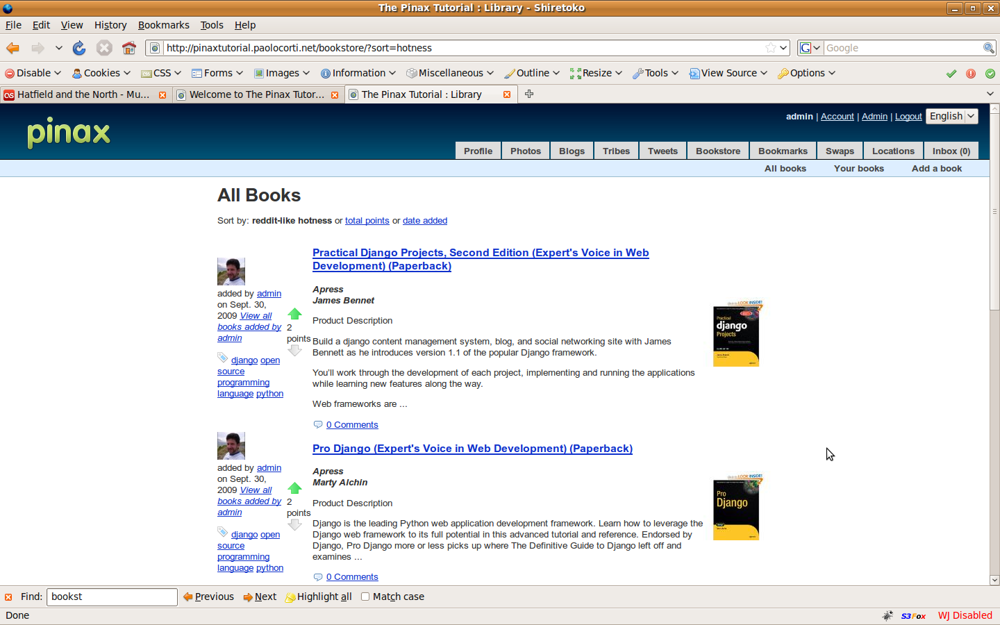

Introduction
============

In the last weeks I was studing `Pinax <http://pinaxproject.com>`_ , an open source platform for building Django applications. While I enjoyed a lot learning how to develop software with this framework, and I am going to happily use it for a series of projects, I found a bit difficult to get documentation about it, if not reading the source code and the (few - at this time) documentation on the project web site.

When I started, I decided to write a test application for understanding the Pinax philosophy before going for real development projects. I think it can be very useful for other developers new to Pinax to write down my experience. This is why I am going to write this tutorial, hoping it will be really useful for the Django/Pinax community.

While reading my posts, if you find errors or you have suggestions to give, please don't hesitate to put some comment in my blog's posts: I will try to update the tutorial, trying to make it a good resource for people willing to learn to develop with Pinax.

Intended audience
-----------------

You may easily follow this tutorial if you have some Python and Django experience.
But even if you are new to Python and Django, you may reasonably follow this tutorial picking a bit of Python and Django confidence from the following resources (note, however, that you should have programming experience and you should not be new to web development).

If you are new to Python
************************

According to the `Python web site <http://www.python.org/>`_ *"Python is a programming language that lets you work more quickly and integrate your systems more effectively. You can learn to use Python and see almost immediate gains in productivity and lower maintenance costs.
Python runs on Windows, Linux/Unix, Mac OS X, and has been ported to the Java and .NET virtual machines."*

If you are new to Python you can be quickly become productive with it, using `these popular resources <http://wiki.python.org/moin/BeginnersGuide>`_.

There is really a lot of documentation, I highly recommend `this excellent tutorial <http://docs.python.org/tutorial/>`_ or the popular `Dive Into Python book <http://diveintopython.org/>`_.

If you want quickly enter Django and then Pinax you may try `Instant Python <http://hetland.org/writing/instant-python.html>`_.

If you are new to Django
************************

As written in the `Django web site <http://www.djangoproject.com/>`_, *"Django is a high-level Python Web framework that encourages rapid development and clean, pragmatic design.".*

Many of you will have heard about the Ruby on Rails web framework: we can confidently say that Django is to Python what Ruby on Rails is to Ruby.
Like Ruby on Rails, Django promotes the DRY principles, helping the developers to write web applications in an agile manner. Like Ruby on Rails - but of course in a different fashion - Django provides an object-relational mapper, an elegant URL design system, a powerful template system, an impressive cache system, and other goodness that a modern web framework should provide.

If you want to master Django you should read `the excellent documentation <http://docs.djangoproject.com/en/dev/>`_.

You may quickly get the a taste of Django, and come back to the Pinax tutorial, using the famous `Django's tutorial <http://docs.djangoproject.com/en/dev/intro/tutorial01>`_.

What is Pinax
-------------

According to the `Pinax web site <http://pinaxproject.com>`_: *"Pinax is an open-source platform built on the Django Web Framework. By integrating numerous reusable Django apps to take care of the things that many sites have in common, it lets you focus on what makes your site different."*

When you are developing a web site, if you choose Django as the web framework you have already a lot of goodness that make your work a lot easier than with other web frameworks.

But many web sites have many common elements, like blogs, wikis, photo galleries, tagging systems and so on and it would be crazy to design and develop them from scratch over and over again.

This is the idea behind the Pinax Project, originally named `Django Hot Club <http://code.google.com/p/django-hotclub/>`_ like the `jazz group <http://en.wikipedia.org/wiki/Quintette_du_Hot_Club_de_France>`_ founded in France by `Django Reinhardt <http://en.wikipedia.org/wiki/Django_Reinhardt>`_ (that gives its name to Django): following the DRY principles, the Pinax Project is a collection of Django application you should use in your web projects for not starting from scratch every time.
Pinax try to make you re-use software in the smartest way.

Shortly, these are some of the applications included in Pinax that you could use for your web development:

* **ajax_validation**, a simple application for performing ajax validation of forms created using Django’s forms system based on jQuery;
* **announcements**, gives you the ability to manage announcements and to broadcast them into your site (keeping track in session of already displayed ones) or by emailing users;
* **avatar**, allow users to manage avatars for their profile;
* **blog**, a blog application;
* **bookmarks**, let users manage bookmarks;
* **django_openid**, gives to Pinax `openid <http://openid.net/>`_ support; 
* **django_sorting**, allow easy sorting objects list, and sorting links generation;
* **emailconfirmation**, it's for cases where you don't want to require an email address to signup on your website but you do still want to ask for an email address and be able to confirm it for use in optional parts of your website;
* **flag**, gives the users the possibility to flag contents, for example photo that are considered inappropriate;
* **friends**, let users to ask friendship from other users or from people external to the site;
* **geopy**, a geocoding application for geocoding addresses from Google Maps, Yahoo! Maps, Windows Local Live (Virtual Earth), geocoder.us, GeoNames, MediaWiki pages (with the GIS extension), and Semantic MediaWiki pages. Used from the locations application;
* **gravatar**, for letting the users to use their `gravatar <http://en.gravatar.com/>`_ as avatar;
* **locations**, gives the user the ability to put geo-locate himself at any time;
* **mailer**, gives you the ability to queue mail messages and notifications for asynchronous delivery;
* **messages**, gives the user the possibility to send messages to other users. Each user is provided with a message box where messages can be kept or deleted;
* **microblogging**, a twitter clone;
* **notification**, a notification framework;
* **oembed**, gives the site `oembed <http://www.oembed.com/>`_ support, for allowing an embedded representation of a URL on third party sites, like Flickr or YouTube;
* **pagination**, let the developer to easily paginate objects list;
* **photologue**, a photo management applications. Users may create photo galleries, and associate them to other contents;
* **projects**, a project application with task and issue management;
* **pygments**, the popular syntax highlighter (to be used, for example, in the wiki and in the blog application);
* **pytz**, for time zone calculations;
* **robots**, for managing web robots access rules to your site;
* **swaps**, for letting a user to swap something with another user;
* **tagging**, let the user to tag any kind of content (ex: a blog post). The user can then browse content by tag;
* **template_utils**, a collection of utilities for text-to-HTML conversion. Supported format are Textile, Markdown, reStructuredText (to be used, for example, in the wiki and in the blog application);
* **threadedcomments**, let the user to write comments on content, even in a threaded way;
* **tribes**, an interest groups management application, where users belonging to that group may take part to topics;
* **uni_form**, provide a simple tag and/or filter that lets you quickly render forms in a div format;
* **vobject**, is a Python package for parsing and generating vCard and vCalendar files, and gives Pinax the ability for example to import contact from GMail or Yahoo;
* **voting**, let the user to vote content in a `reddit-like fashion <http://www.reddit.com/>`_;
* **wiki**, a wiki application for your site;

The Book Store application
--------------------------

The aim of this tutorial is to teach you Pinax (and Django) with an hands on project. We will build a real application: a book store component for Pinax, following the best practices used from other Pinax projects.

Note that for developing the book store application I was largely inspired by other Pinax applications. 
In fact you will find in the book store application many similiar elements to the `bookmarks application <http://code.google.com/p/django-bookmarks/>`_, to the `microblogging application <http://code.google.com/p/django-microblogging/>`_, and to other ones. So thanks to the smart developers of these applications!

To get a quick idea of the tutorial final's result, you may have a look at the book store application we will develop: `here is a live instance <http://pinaxtutorial.paolocorti.net>`_ (you need to register to access it).

We want to build a Pinax application to manage the books of a book store (something like in the Amazon fashion).

These are the  `user stories <http://en.wikipedia.org/wiki/User_story>`_ of the book store application we want to build:

* for every book we want to store the following attributes: title, author, publisher, description, cover art, tags;
* users can browse all of the books;
* books browsing must provide pagination;
* users can add books to the store;
* users can update and delete their books;
* users can vote for a book in a reddit-like fashion;
* users can comment on a book. Comments can be threaded;
* books can be browsed by user and by tag;
* user profile section must provide a book section with every book added by the profile's user;
* users can access RSS feeds of book lists (global list and per user list);
* every book must show which user has added and its avatar (or gravatar if the user has one);
* a user must be notificated (optionally via email) every time a comment is made on a book he has added;
* a user can flag a book added by another user as inappropriate (and an administrator may remove it later);
* the application can be easily localized in different languages to be used in any country.

Tutorial index
--------------

This is the planned tutorial index (there will be a blog post for each paragraph in the next days, as often as i will have the time to post):

* Installing Pinax and making basic customisation
* Create the book store django's application and plugging it into Pinax
* Using pagination, avatars and profiles
* Using the voting application
* Using the tagging application
* Using the feeds application
* Enabling threaded comments for the book store application
* Implementing notifications
* Using the flag application
* Deploying Pinax

Time to start the Pinax Tutorial!
