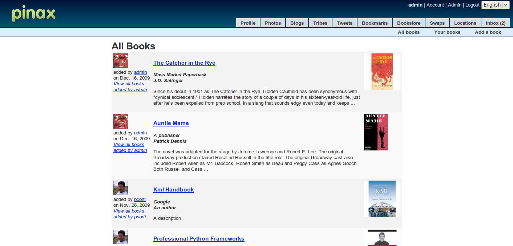
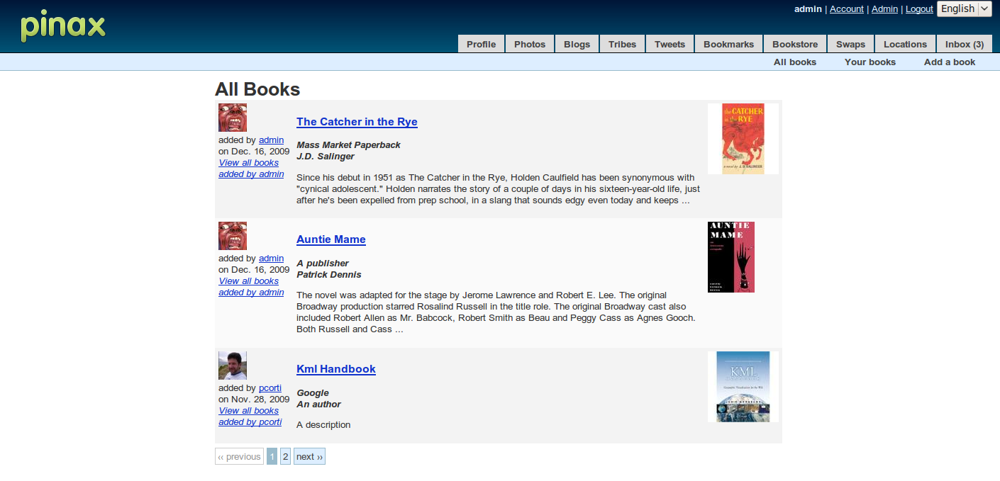
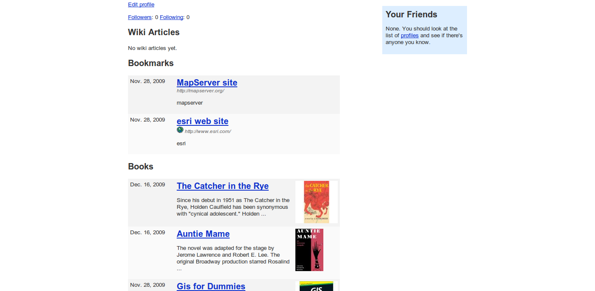

======================================
Using avatars, pagination and profiles
======================================

Introduction
------------

In this part we will improve the Bookstore application and we will see how easy it is to add support for three core features that any web 2.0 sites is supposed to offer:

* support for avatars
* support for pagination
* support for user profiles

Adding support for avatars
--------------------------

In Pinax you may use two kind of avatars for your users (in both case you may manage them from the Avatar page: http://localhost:8000/avatar/change/):

* `gravatars <http://en.gravatar.com/>`_
* custom avatars

In the first case Pinax will render your avatar using the gravatar you have associated to your email from the Gravatar web service. In the latter Pinax will use a custom avatar you have uploaded to the Pinax web site.

For managing avatars in the Pinax application you are building, you will use the Avatar application (be sure you are importing it in your settings file, the default for this is true so you shouldn't do anything there).

Adding support for avatars in your Pinax application is just as easy as to do the following two things in your templates:

* import the avatar tags library 
* use the  tag in your templates

For the Bookstore application it will be enough to use the avatar tag in this way: 

Where the first parameter is the user for which you want to render the avatar, and the second parameter is the avatar size in pixels.

So you need to do this in your templates (books.html, book.html):

PROJECT_ROOT/bookstore/templates/bookstore/books.html template ::

	
	
	
	...
		<!-- alternate -->
		
		    <table class="bookstore">
		        
		            <tr class="">
		                <!-- meta -->
		                <td class="meta" >
		                	


		                    
added by <a href="">{{ book.adder }}</a>

	...

PROJECT_ROOT/bookstore/templates/bookstore/book.html template ::

	
	
	
	...
		    

		        <!-- meta -->
		        


		        
added by <a href="">{{ book.adder }}</a>
on {{ book.added|date }}
		    

	...

Now if you run your application, you will see that avatars are there: http://localhost:8000/bookstore/

Adding support for pagination
-----------------------------

For managing pagination in the Pinax application you are building, you will use the Pagination application (be sure you are importing it in your settings file, the default for this is true so you shouldn't do anything there).

Adding support for pagination in your Pinax application is just as easy as to do the following two things in your templates:

* import the pagination tags library 
* use the  and  tag in your templates

For the Bookstore application it will be enough to use the autopaginate tag in this way: 

Where the first parameter is the collection for which you want to implement pagination, and the second parameter is the number of elements for each page (5 books for each pagination).

So you need to do this in your books.html template: PROJECT_ROOT/bookstore/templates/bookstore/books.html template ::

	
	
	
	
	...
		
		
		
		    
		    <table class="bookstore">
		        
	...
		        
		    </table>
		    
		
	...

Now if you run your application, you will see that the support for pagination is now implemented: http://localhost:8000/bookstore/

Adding support for user profiles
--------------------------------

Pinax provide a Profile page: a page where it is possible to get information about a particular user. You may see how it is structured this page reaching this url: http://localhost:8000/profiles/profile/username/ (replace username with the username for which you want to see the Profile page).

As you many notice, there are many things in the Profile page, for example for each user our project (based on the Pinax social project) presents you: the wiki articles, the bookmarks, the blog posts, the tweets, the photoes and so on: basically all the contents that have been added by that user.

We want to add in the Profile page a section for the Bookstore: there will be the books that have been added in the Bookstore application by that user.

For doing so if you investigate in the Pinax source code, you will realize that you need to customize this template: PINAX_ROOT/templates/default/profiles/profile.html

But I do not want to modify Pinax source code, instead I will copy this template in the the Pinax project and will modify it. So I copy this template as PROJECT_ROOT/templates/profiles/profile.html template and I add a Books section in it, like in the following code:

PROJECT_ROOT/templates/profiles/profile.html::

	...
		            <h2></h2>
	...
		            <h2></h2>
		            
						<table class="bookstore narrow">
							
								<tr class="">
									<td class="meta">
										{{ book.added|date }}
									</td>
									<td>
										<h2><a href="/bookstore/{{ book.id }}/book/">{{ book.title }}</a></h2>
										
{{ book.description|linebreaks|truncatewords:20 }}

									</td>
									<td>
										
{{ book.thumb|safe }}

									</td>
								</tr>
							
						</table>
					
						
						
You haven't added any <a href="/bookstore/">books</a> yet.

					
		            <h2></h2>
	...

Now run your application and note that if you access an user profile page, you will also see the books he/she has added to the Bookstore application in the portal:

    
Notes
-----

As usual I have updated the gitHub repository for this project (the tutorial) with all the stuff you many need to go along with it:

* You can find the code of this part of the tutorial `here <http://github.com/capooti/pinaxtutorial/tree/PinaxTutorial-4>`_
* You can find updated documentation in reST format ` here <http://github.com/capooti/pinaxtutorial/tree/PinaxTutorial-4/docs/>`_
* You can download a pdf copy of this tutorial here `<http://github.com/capooti/pinaxtutorial/blob/PinaxTutorial-4/pinaxtutorial.pdf>`_

